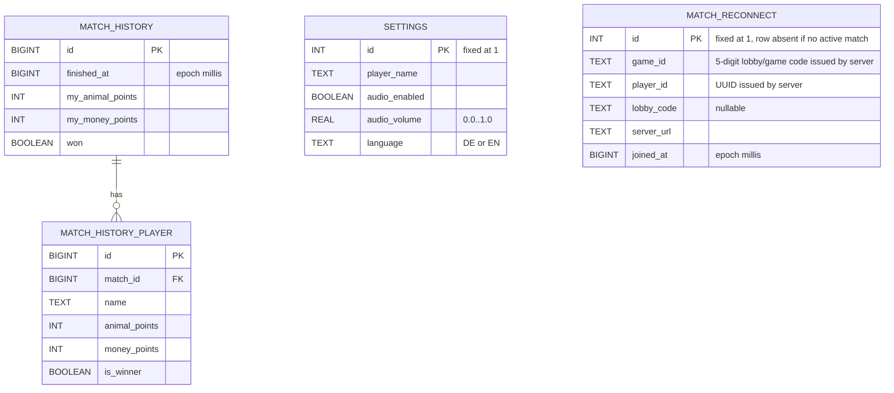

# Client-Side Database Design

Planned client-side persistence model for the Kuhhandel Android app. Mirror
document of `docs/server-database.md`.

## Scope: transient vs. persisted

UI state and synchronized server state stay in memory. Local SQLite (via
Room) persists only what is needed to survive app-process death.

**Transient (in-memory only):**

- live `GameState` and sub-state (auction, trade) — server-authoritative,
  streamed via WebSocket
- WebSocket connection status, retry counters
- UI state (current screen, scroll positions)

**Persisted (local SQLite via Room):**

- User settings (player name, audio, language)
- Match-reconnect context (resumes an active match after app-kill)
- Game history (finished matches with opponents)

## Tech choice: Room

Room (Jetpack's SQLite wrapper) is used because the schema needs a real
1:N relation (`match_history` → `match_history_player`), which DataStore
handles awkwardly. Room also integrates natively with Coroutines/`Flow`
for Compose UIs.

## ER diagram

## Table summary

| Table | Purpose | Lifetime |
|---|---|---|
| `settings` | Singleton row holding user preferences (name, audio, language) | persistent, exactly one row |
| `match_reconnect` | Active-match context for surviving app-kill | created on lobby join, deleted on FINISHED or explicit leave |
| `match_history` | One row per finished match from the local user's perspective | persistent, accumulates over time |
| `match_history_player` | One row per participant in a finished match (including the local user) | persistent, cascade-deleted with `match_history` |

## Design notes

- **Singleton tables (`settings`, `match_reconnect`) use a fixed primary
  key `id = 1`** instead of separate key-value stores, so everything lives
  in one DB with a single migration path.
- **`match_reconnect` lifecycle**: inserted on lobby join, deleted on
  FINISHED or explicit leave. On app start, if the row exists, the app
  asks the server whether `game_id` is still active; if not, the row is
  purged.
- **`match_history_player` stores opponent display names**, not server
  player IDs, because the server issues anonymous UUIDs that don't persist
  past match end (see `docs/server-database.md` "Known limitations").
- **`match_history.won` is denormalized** for fast win-rate queries; it is
  redundant with `match_history_player.is_winner` but avoids a join.

## Known limitations

- Single user per app install — no profile-switching.
- History integrity is local-only — a user could edit the SQLite file.
  Acceptable for the prototype.

## References

- [#80 — Clientside Database Creation](https://github.com/AAUSoftwareEngineering2/SE2_Gruppenprojekt/issues/80)
- [#153 — Design a Minimal Client-Side Persistence Model](https://github.com/AAUSoftwareEngineering2/SE2_Gruppenprojekt/issues/153)
- [#159 — Plan Client-Side Database Design and Local Persistence Diagram](https://github.com/AAUSoftwareEngineering2/SE2_Gruppenprojekt/issues/159)
- [#160 — Implement Client-Side Persistence](https://github.com/AAUSoftwareEngineering2/SE2_Gruppenprojekt/issues/160)
