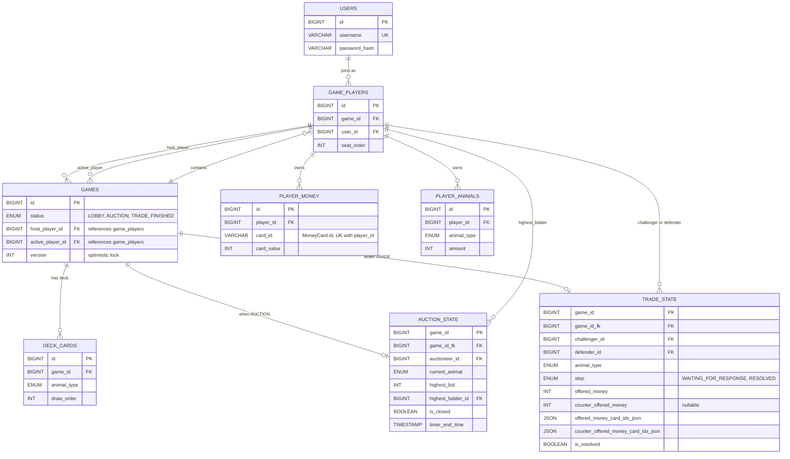

# Server-Side Database Design

This document defines the planned server-side persistence model for the
Kuhhandel prototype: which game state is persisted, the relational schema, and
the lifetime of each table.

The mirror document for the Android client is planned as
`client-database.md`, but it does not exist yet.

## Scope: transient vs. persisted

Not all game state is written to the database — some is intentionally kept in
memory because losing it on a restart is acceptable for the prototype.

**Transient (in-memory only, lost on server restart):**

- the live `GameState` while a match is running, including the shuffled
  `AnimalDeck` and each player's in-memory money cards
- the WebSocket session ↔ player mapping in `ConnectionRegistry`

**Persisted (writes go to PostgreSQL):**

- Room / Match — `gameId`, `status`, host, optimistic-locking version
- Players in a match — id, name, seat order
- Animal deck draws — so the match can be reconstructed after a crash
- Per-player money cards and animals
- Active auction or trade state, while the match is in those phases

## ER diagram

> In the actual DDL, `auction_state.game_id` and `trade_state.game_id` are each
> a single column carrying both the primary key and a foreign key to
> `games.id`. Mermaid cannot render the dual constraint on one column, so the
> diagram splits them visually.

## Table summary

| Table | Purpose | Lifetime |
|---|---|---|
| `users` | Player accounts (username + password hash) | long-lived |
| `games` | One row per match. `host_player_id` (FK → `game_players`) identifies who may perform host-only actions (e.g. start game). `status` drives which transient state table is populated. | per match |
| `game_players` | Join row between a user and a game, with the user's seat order | per match |
| `deck_cards` | Persisted draw pile per game so the match can be rebuilt after a crash | per match |
| `player_money` | One row per money card owned by a player. `card_id` stores the stable `MoneyCard.id` string so trade offers can reference specific cards after a restart. | per match |
| `player_animals` | Aggregated by animal type — one row per type a player owns (e.g. 2× cows → one row with `amount = 2`) | per match |
| `auction_state` | One row per game while the match is in `AUCTION` | transient sub-state |
| `trade_state` | One row per game while the match is in `TRADE` | transient sub-state |

## Design notes

- **JSON columns** (`offered_money_card_ids_json`,
  `counter_offered_money_card_ids_json`) store the lists of `MoneyCard.id`
  strings attached to a trade offer. A normalised sub-table is avoided because
  the prototype neither queries across these lists nor aggregates them — fewer
  joins, faster schema evolution.
- **`trade_state.step` and `trade_state.is_resolved` are both persisted**
  because the server-side state machine checks them independently when
  validating trade transitions (see `GameStateMachine.kt`). `step` tracks where
  in the trade flow the players are; `is_resolved` is the explicit terminal
  flag once the trade has been settled.
- **`games.version`** maps to JPA's `@Version` annotation for optimistic
  locking. Multiple WebSocket handlers can update the same match concurrently
  (for example, two bids arriving at nearly the same time during an auction,
  or competing trade responses during a trade), so optimistic locking
  prevents lost-update conflicts.
- **`games.host_player_id` and `games.active_player_id` reference `game_players`**,
  not `users`. Because the server currently issues anonymous UUID player IDs
  (see Known Limitations), there is no `users` row to reference. Pointing these
  FKs at `game_players` also implicitly enforces that the host and the active
  player are seated in the same match.
- **`player_money` stores one row per card** with its stable `card_id` (the
  `MoneyCard.id` string). Trade offers reference specific card IDs, so
  aggregating by value would make it impossible to reconstruct an active trade
  after a restart. In contrast, `player_animals` aggregates by type because
  animals have no individual identity in the game logic.
- **`game_players.seat_order`** is the persistent counterpart of
  `currentPlayerIndex` in the in-memory `GameState`. Storing it explicitly
  lets the round flow be reconstructed without depending on insertion order.
- **`auction_state` and `trade_state` are keyed by `game_id`**, so a match can
  hold at most one active auction and one active trade at a time. When the
  phase ends the row is deleted.

## Known limitations

Authentication is not yet part of the runtime. The `users` table is included in
the schema for completeness, but the server currently issues anonymous,
server-generated player IDs at lobby join time. Adding real auth is tracked
separately and is out of scope for the prototype.

## References

- [#152 — Design a Minimal Server-Side Persistence Model](https://github.com/AAUSoftwareEngineering2/SE2_Gruppenprojekt/issues/152)
- [#157 — Plan Server-Side Database Design and Persistence Diagram](https://github.com/AAUSoftwareEngineering2/SE2_Gruppenprojekt/issues/157)
- [#158 — Implement Server-Side Persistence](https://github.com/AAUSoftwareEngineering2/SE2_Gruppenprojekt/issues/158)
